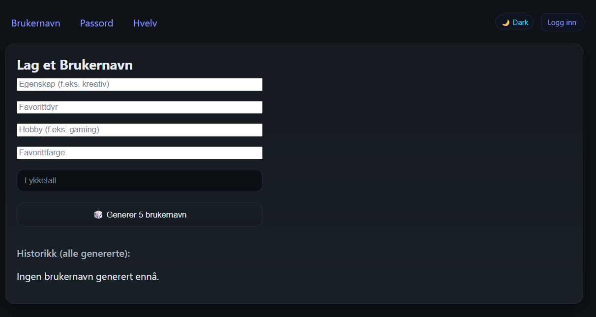
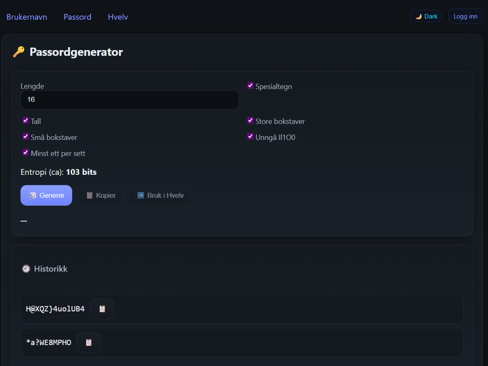
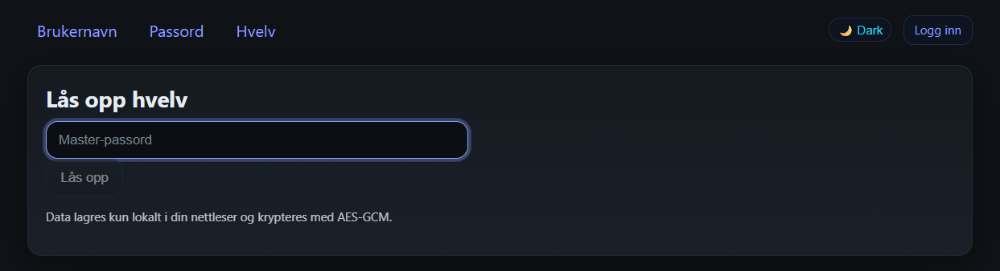
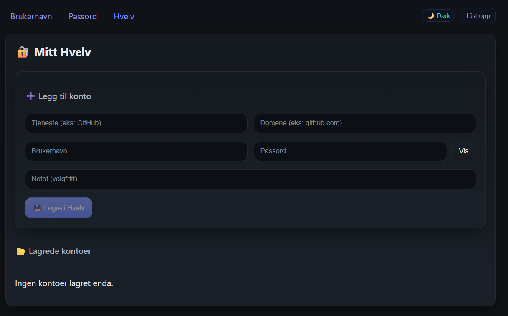

# CipherNest
Meningen med dette programmet er å lagre brukere man har rundt om på nette til et sted hvor man kan ha en oversikt over brukernavn og passord. I dagens samfunn kreves det brukere og passord til alt mulig og det er lett å glemme hvilke brukere som passer til de ulike systemene. 

Jeg ønsker at systemet er sikkert og har stort fokus på dette. 

## Skjermbilder

## Username

## Password 

## Vault login

## Vault

